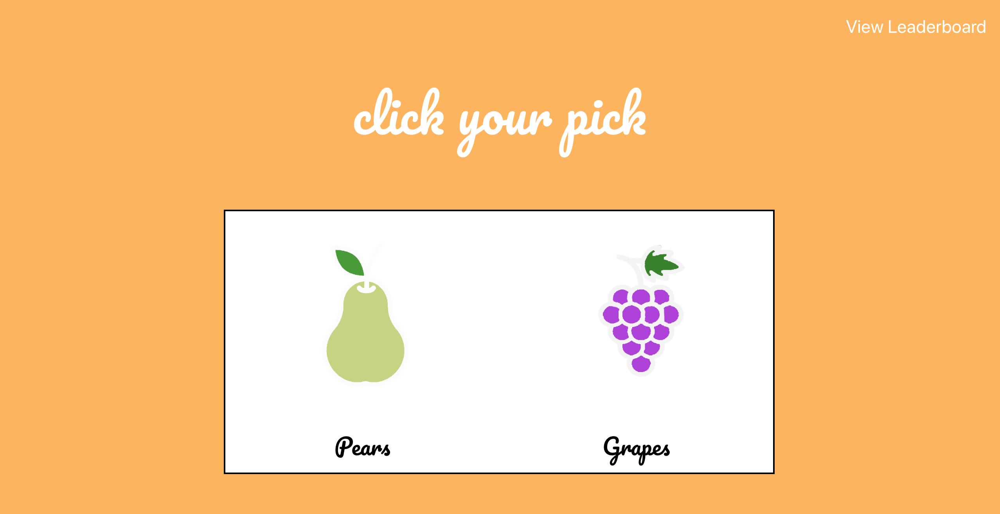

# Fruit Fight

## Description
Fruit Fight is a simple web application that prompts a user to pick their favorite of two random fruits, saves their response, and then repeats. The app also has a Leaderboard that displays the current satndings, or the Elo Rating of each fruit based on the user responses. The concept came from August Warren, github.com/GWarrenn. Now we can finally answer one of life's oldest question: what is the best fruit?

## Example

## Features
-The Fight, or the fruit selection screen
-The Leaderboard using the Elo Rating system: [Wikipedia](https://en.wikipedia.org/wiki/Elo_rating_system)
-A database of Matchups, or every set of fruits that was displayed to a user and the winner, or which fruit the user selected
-The option to leave a comment and delete that comment if wanted

## Technologies Used
-Node/Express
-MongoDB/Mongoose
-Handlebars
-CSS

## Installation
This app has a few node packages as dependencies. Can be installed using npm install if the reposotiry is forcked and cloned down.

## Unsolved Problems
The CSS files would link on the render of the comment/show view, but they would be empty files. I wrote the simple CSS styling inline for that view instead.
I would also like to implement user authentication and an option to view just your personal leaderboard, as opposed to the global leaderboard.

